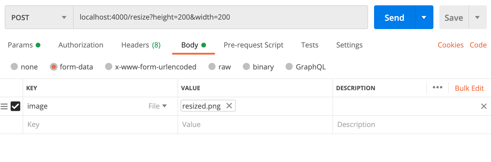

# Image-Resizing-Service

Handles common image manipulation tasks - in its current form this is just the resizing of PNG and JPEG images.

## Quick start

To build and run the service from source:
1. Install [Golang](https://golang.org/)
2. Run `go mod download` at the root level of your local copy of this repository
3. Run `go run ./cmd/api`

Alternatively, run the relevant binary for your platform from the produced binaries in the `/bin` folder. I included binaries for Windows, Mac (non-M1) and Linux.

This will set up the service on port 4000. Postman / curl / any other REST client can be used to call the endpoints (see "Supported Functionality" below for a list of these).

The image resizing call can be done via Postman like so:

To run the tests:
1. Run `go test ./...` from the root level of the directory

### Makefile
A [Makefile](./Makefile) is also present to make some of these steps easier - however, due to some shell commands being used, it can only be used in Windows Subsystem for Linux, OSX, or a Linux distro. 

Building via the Makefile will also inject the version (taken from git) into the application (which can be seen in the `/ping` endpoint.)

### Container build

The service also has Docker support. To run the service in a container:
1. Run `docker build -t image-resizing-service .` at the root level of your local copy of this repository
2. Run `docker run -p 4000:4000 image-resizing-service`

This will map the service to port 4000, as with the quick start, and you'll be able to call the endpoints using any REST client. The IP the service will be available on can change based on the version of Docker being used (e.g Docker Desktop uses localhost, Docker Toolbox uses the IP of whichever VM it spins up to handle Docker operations)

## Supported functionality

The service currently has the following endpoints:

| Method | Endpoint                 | Description                                                                                                                                                                                                                                                                                                             |
|--------|--------------------------|-------------------------------------------------------------------------------------------------------------------------------------------------------------------------------------------------------------------------------------------------------------------------------------------------------------------------|
| GET    | /ping                    | Returns "OK"  - this is just included to allow for a quick test that you can connect, but also includes some application metadata                                                                                                                                                                                                                                                                                                           |
| GET    | /capabilities            | Returns a JSON object containing the capabilities of the service (for now this is just a list of the supported file extensions)                                                                                                                                                                                                   |
| POST   | /resize?height=X&width=X | Takes in an image from the `form-data` of a POST request, and returns the image resized to match the provided height and width. If one of the values is left unspecified, the resizer will automatically retain the same aspect ratio that the original image has while resizing the image to match the provided value for the given dimension. |
